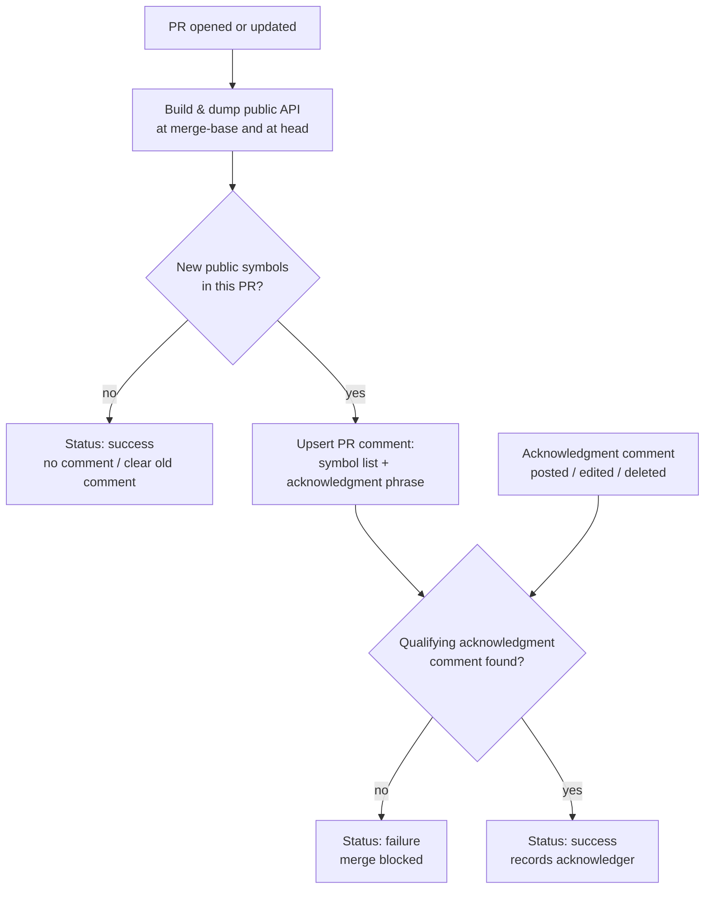

# API Additions Signoff Gate — Shaping Document

| Field    | Value                                          |
|----------|------------------------------------------------|
| Date     | 2026-08-11 (updated 2026-08-18 per review feedback) |
| Status   | Open questions resolved                        |
| Team     | Platform SDK (Swift)                           |
| Author   | Jared Hightower                                |
| Audience | All (Product / Engineering / SDK stakeholders) |

---

## Problem

Every symbol the SDK marks `public` is a support commitment: once it ships in a release, external
developers can build on it and we cannot remove or change it without a breaking release. Today a PR
can add new public API and merge with nobody explicitly confirming the addition was intentional —
reviewers see the code diff, but nothing forces the question "are we ready to support this
forever?" The repo already blocks *breaking* changes behind a human signoff
(`major-release-signoff.yml`), but *additions* — the more common way accidental commitments happen —
have no equivalent gate.

---

## Open Questions — Resolved (review feedback, 2026-08-12 → 2026-08-14)

1. **Acknowledgment strictness** — **Resolved.** The person with authority to approve the PR is the
   one confirming the addition is OK — the gate is part of the automated checks, it flags any change
   to the public surface, and the reviewer overrides (acknowledges) it. Acknowledger must be a
   write-access collaborator other than the PR author.
2. **Merge blocking** — **Resolved.** The check surfaces as a warning-style failing status that a
   reviewer can clear by acknowledging — not an unconditional block. For external contributions it
   is also an education moment: a change to the public surface is part of our support commitment,
   and we make those changes explicit.
3. **Fork contributions** — **Resolved.** The gate MUST run on PRs from external forks. External
   contributions must not be able to bypass it; internal reviewers must be able to approve and
   incorporate the addition into a formal release (possibly MAJOR/BREAKING). What a fork does
   privately in its own copy is out of scope — only PRs submitted back to this repo are gated.
4. **Rubber-stamp review** — **Resolved.** The engineering lead audits acknowledgment quality;
   expectation is this will be obvious in practice quickly.

---

## Why It Matters

- **Accidental API commitments are permanent.** A helper left `public` instead of `internal` ships
  in the next release and must be supported until the next major version. Catching it pre-merge
  costs one comment; catching it post-release costs a deprecation cycle.
- **The ticket's acceptance criterion is explicit:** a human must be able to verify the output of
  `scripts/check-api-stability.sh additions` before a release goes out. Today that script exists
  but nothing in the process forces anyone to look at it.
- **Reviewer visibility gap:** new public symbols are scattered across a code diff; reviewers have
  no consolidated view of "this PR grows the public surface by N symbols."
- **Parity with existing practice:** breaking changes already require explicit human signoff in
  this repo. Additions are the same class of commitment at lower severity — same treatment, lighter
  weight.

---

## Target Experience

### PR author

Pushes a PR that adds `public func foo()`. Within minutes, a bot comment appears on the PR:

> **📣 This PR adds 3 public API symbols** — merging commits the SDK to supporting them.
> *(grouped list by source folder, same format as `check-api-stability.sh additions`)*
> To proceed, a maintainer must reply with the acknowledgment phrase below.

A commit status `api-additions-signoff` shows as failing until acknowledgment. If the author
realizes an addition was accidental, they push a fix marking it `internal`; the comment updates to
"no public additions — gate cleared" and the status flips to success automatically.

### Reviewer / maintainer

Sees the consolidated symbol list without hunting through the diff. If the additions are
intentional, copy-pastes the ready-made acknowledgment reply. The status flips to success and
records who acknowledged. If not intentional, requests changes as usual.

### What stays the same

- The existing breaking-change check (`api-stability.yml`) and major-release signoff gate are
  untouched — additions and breakages remain separate signals.
- PRs that touch no public API see nothing: no comment, status passes silently.

### Explicitly deferred

- No change to the release pipeline itself — verification happens at PR time, which is earlier and
  per-change rather than batched at release time.
- No automated filtering of "impactful vs. harmless" additions — every new public symbol is listed.

---

## Solution

### Approach

Clone the repo's proven `major-release-signoff.yml` workflow — comment upsert, acknowledgment
matching, permission verification, commit status — and swap its trigger: instead of detecting a
breaking-change commit message, it detects new public symbols by diffing the API surface between
the PR's merge-base and head using the existing `swift-api-digester` dump machinery and
`report-api-additions.py`. Per-PR diffing (not diff-against-committed-baseline) keeps the comment
scoped to *this PR's* additions, avoiding the cumulative-noise failure mode.

### Diagram

*Detect per-PR public API additions, surface them in one comment, gate merge on a human
acknowledgment, and clear automatically when additions are removed. Physically split into an
unprivileged detect workflow and a privileged gate workflow so fork PRs are covered — see
"Fork support" below.*

### Implementation Notes

#### Detection (per-PR API diff)

- Reuse `dump_module` from `scripts/check-api-stability.sh`: `swift build -c release` +
  `xcrun swift-api-digester -dump-sdk` for the three modules, once at the merge-base commit and
  once at head.
- Feed both dump directories to `scripts/report-api-additions.py` (already computes set-difference
  and groups by source folder). Small change: accept two dump dirs instead of baseline-dir +
  current-dir semantics if needed; output both human text and a machine-readable count.
- Runner: `macos-26` with `XCODE_VERSION: latest-stable`, matching `api-stability.yml`.
- Gate the expensive build behind a `paths` filter (`Sources/**`, `Package.swift`) so docs-only
  PRs skip it entirely.

#### Fork support: two-workflow split (decision, 2026-08-14)

Fork PR tokens are read-only — they cannot post comments or statuses — but the gate must cover
forks. So the workflow is split following the repo's `coverage-comment.yml` pattern:

- `api-additions-signoff.yml` (**detect**, unprivileged): runs on `pull_request` for every PR
  including forks, builds and diffs the API surface, and uploads the report + metadata as an
  artifact. `permissions: contents: read` only — untrusted fork code never runs with a write token.
- `api-additions-signoff-gate.yml` (**gate**, privileged): runs on `workflow_run` completion of
  detect, always executing trusted code from the default branch. Downloads the artifact, searches
  for acknowledgment, upserts the PR comment, and posts the commit status. Also hosts the
  `issue_comment` re-evaluation job.

#### Comment and acknowledgment mechanics (lifted from major-release-signoff.yml)

- Marker comment `<!-- api-additions-signoff -->`, upserted (PATCH existing, never spam).
- Comment opens with an education line for (especially external) contributors: public symbols are
  a long-term support commitment, the check exists to make each addition a deliberate promise.
- Comment body: one orientation line, the grouped symbol list, and a copy-paste-ready reply block
  containing a verbatim acknowledgment phrase, e.g. *"I confirm these public API additions are
  intentional and we are committing to support them."*
- Acknowledgment matching: same normalization (strip quote markers, collapse whitespace), bot
  accounts skipped, permission lookup fail-closed, permission cache — all verbatim from the
  breaking-change gate (hardened in af9f8e5).
- Triggers: `pull_request` (opened, synchronize, reopened) + `issue_comment` (created, edited,
  deleted) so the gate re-evaluates when acknowledgments appear or disappear.
- Commit status context `api-additions-signoff`: failure with "N public additions awaiting
  acknowledgment", success with "acknowledged by @user" or "no public API additions".
- Concurrency group per PR, cancel-in-progress.

#### Edge cases

- **Additions redacted after acknowledgment:** a new push re-runs detection; if additions are gone,
  status succeeds and the comment is updated to inactive. If a *different* set of additions
  appears, the prior acknowledgment must not carry over — include a hash of the symbol list in the
  comment and require the acknowledgment to postdate the latest symbol-list change.
- **Base branch moves:** diff against the merge-base of head and `main`, not `main` tip, so
  unrelated additions merged to main don't leak into the PR's list.
- **Digester noise:** synthesized declarations (e.g., `==` on Equatable structs) appear in
  additions output; keep the existing "Synthesized or associated declarations" grouping so
  reviewers see them as secondary, not as separate commitments.
- **Missing baseline / build failure:** fail the status with a clear message; never silently pass.

#### v1 constraints

- Fork PRs are in scope (resolved Open Question 3) via the detect/gate workflow split above.
- No impact analysis or symbol classification — flat list, human judgment.
- English-only comment text.

---

## Testing Plan

In order of value:

1. **Local dump run (first, cheap):** `scripts/check-api-stability.sh dump /tmp/api-dump` on a Mac
   verifies the new mode against the real build. The whole detect step can be simulated locally:
   dump at `main`, check out a branch with a test symbol, dump again, then
   `scripts/check-api-stability.sh report /tmp/dump-a /tmp/dump-b --count-file /tmp/n`.
2. **Stacked scratch PR (real end-to-end for `detect`, pre-merge):** branch off the implementation
   branch, add a dummy `public func gateTest()` in `Sources/YouVersionPlatformCore/`, and open a PR
   **with the implementation branch as base, not `main`**. `pull_request` workflows run from the
   merge ref, so the detect workflow executes with the paths filter matching. Expected: a detect
   run that uploads the `api-additions-detect` artifact with the symbol report, count, and hash.
3. **Post-merge only — the `workflow_run` and `issue_comment` paths:** both triggers always run
   workflows from the *default branch*, so the privileged `gate` job (comment + status posting) and
   the `acknowledge` job cannot be tested before merge. After merge, repeat the scratch PR against
   `main` once: expect the bot comment + failing status, then a write-access collaborator *other
   than the author* pastes the acknowledgment block and the status flips to success without a push.
   Marking the symbol `internal` and pushing should flip the comment to "gate cleared". Also test
   once from a fork to verify the fork path end to end. Close scratch PRs and delete branches
   afterward.

Known limitations: only detection (build + diff + artifact) is testable pre-merge; everything that
writes to the PR runs from the default branch and is post-merge-only by GitHub's design. `act` does
not help (no macOS runner support). The implementation PR itself does not trigger the gate — it
touches no `Sources/**` or `Package.swift`, so the paths filter skips it.

---

## Risks

- **Reviewer rubber-stamping** — the gate's value decays if acknowledgment becomes a reflexive
  copy-paste. Research on review-bot fatigue says keep the comment short, scoped to this PR only,
  and silent when nothing changed. Mitigation: per-PR scoping (built in), and a periodic audit
  (Open Question 4).
- **CI cost and latency** — two release builds per API-touching PR on macOS runners adds minutes
  and runner spend. Mitigation: `paths` filter skips non-source PRs; potential future optimization
  is sharing the build with the existing `api-stability.yml` job.
- **Fork PRs can't clear the gate** — resolved by the detect/gate workflow split: fork PR code
  builds unprivileged, and all writes happen in the `workflow_run` gate that runs trusted
  default-branch code. Residual risk: the artifact contents (report text, count, hash) originate
  from an untrusted build; the gate treats them as data only and never executes them.
- **Gate bypass via admin merge** — admins can merge past a failing required check. Accepted: the
  gate is a forcing function for attention, not a security control; the audit trail (comment +
  status history) still records that the gate was bypassed.
- **Acknowledgment staleness** — approving symbols that later change within the same PR would leave
  a stale approval. Mitigation: symbol-list hash + acknowledgment-must-postdate rule (see Edge
  cases).

---

## Open Questions — Detail

| # | Question | Owner | Status | Decision |
|---|----------|-------|--------|----------|
| 1 | Must the acknowledger be a non-author, or is author self-acknowledgment acceptable? | Engineering lead | Resolved 2026-08-12 | Non-author with PR-approval authority (write access); automated check flags the change, reviewer overrides. |
| 2 | Hard merge block from day one, or advisory failing check? | Engineering lead | Resolved 2026-08-12 | Warning-style failing check the reviewer clears by acknowledging; educational framing in the comment. |
| 3 | Support fork PRs in v1 or same-repo branches only? | Engineering lead | Resolved 2026-08-14 | Fork PRs MUST be gated; external contributors must not bypass. Implemented via detect/gate workflow split. |
| 4 | Who audits acknowledgment quality after ~2 months? | Engineering lead | Resolved 2026-08-12 | Engineering lead; expected to be obvious in practice quickly. |

---

## Appendix

- Ticket: "swift: api additions should be confirmed by humans during the release process" —
  acceptance criterion: a method exists that displays `scripts/check-api-stability.sh additions`
  output for human verification before release.
- Existing in-repo prior art: `.github/workflows/major-release-signoff.yml` (comment-upsert +
  acknowledgment gate, hardened in commit af9f8e5), `.github/workflows/api-stability.yml`
  (breaking-change check on macos-26), `scripts/check-api-stability.sh`,
  `scripts/report-api-additions.py`, `.github/workflows/coverage-comment.yml` (workflow_run
  comment pattern for fork PRs).
- Research inputs (arXiv, read 2026-08-11): 2110.07889 (most flagged API changes affect no real
  client — scope lists per-PR to avoid fatigue), 2607.24601 (moderate explanation maximizes
  reviewer agreement; exhaustive dumps reduce sign-off), 2507.09637 (give context/rationale before
  the acknowledgment ask), 2309.02894 (keep additions and breakage gates separate),
  2601.19065 (shrinking accidental public surface upstream quiets the gate).
- Alternatives considered and not chosen: committed-baseline + CODEOWNERS on `.api-baseline/`
  (durable git record, but noisy machine-generated diffs and workflow change for all
  contributors — candidate for phase 2); Danger/Danger-Swift (new dependency for what existing
  pattern already does); client-impact-filtered diffing (needs a client corpus an SDK pre-release
  doesn't have).
